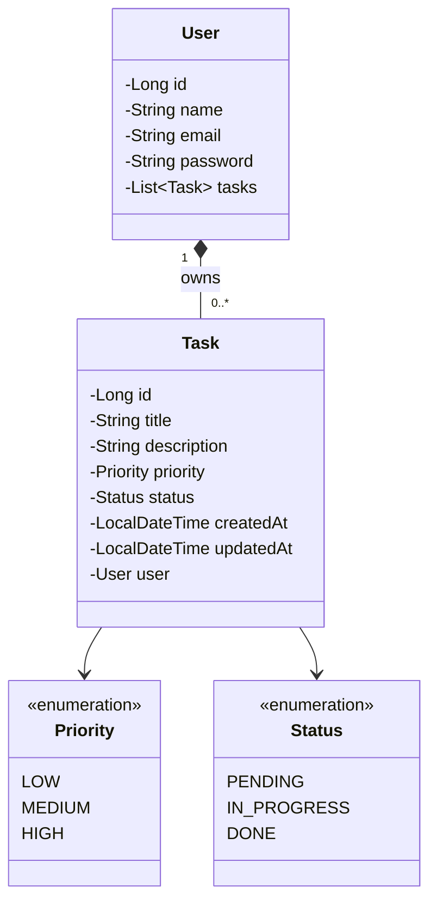

# todo-api

Task Manager (To-Do API)

REST API for managing tasks per user. Each user registers and logs in (JWT authentication) to create, list, update, and delete their own tasks, with filtering by status and priority — never seeing other users' tasks. Interactive documentation available via Swagger.

## Data Model

