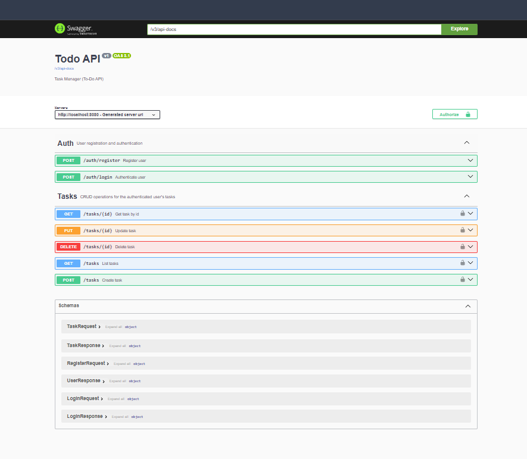
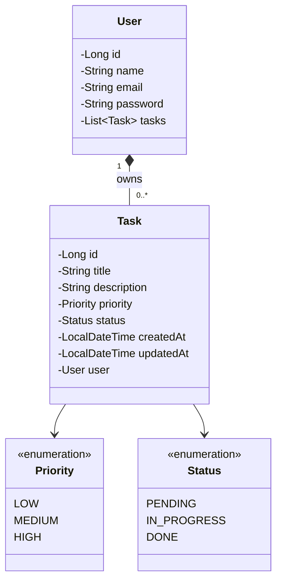

# todo-api

Gerenciador de tarefas (To-Do API)

API REST para gerenciamento de tarefas por usuário. Cada usuário se cadastra e faz login (autenticação via JWT) para criar, listar, atualizar e excluir suas próprias tarefas, com filtros por status e prioridade — nunca enxergando as tarefas de outros usuários. Documentação interativa disponível via Swagger.

## Modelo de Dados

